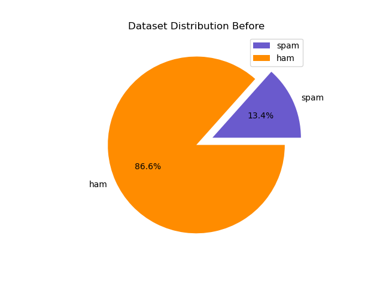
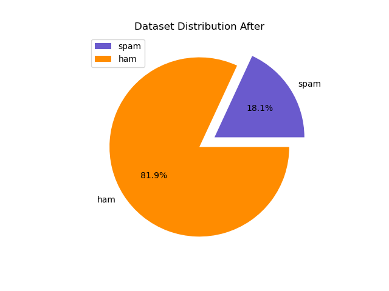
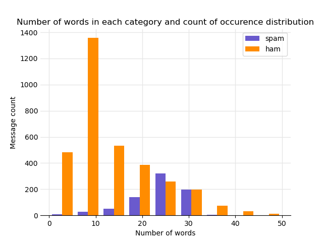

# spam_or_ham
This project is a spam or ham classification system built using machine learning techniques. The models are trained on a dataset of labeled emails and uses natural language processing techniques to convert the emails to vectors, and then classify them as spam or ham.
This repository includes the scripts for training several models, which were then compared to each other. The 3 best models were used to be embedded in a simple chat application with a GUI that offers a spam detection service.

## Dataset
The dataset used for training the models is the [SMS Spam Collection Dataset](https://www.kaggle.com/uciml/sms-spam-collection-dataset) from Kaggle. It contains 5,574 messages, tagged acording being ham (legitimate) or spam.

>Data distribution before cleaning

>Data distribution after cleaning:

> Words per category

## Results
<!-- table -->
| Classifier              | Tag  | Precision | Recall | F1 Score | Support |
| ----------------------- | ---- | --------- | ------ | -------- | ------- |
| Multinomial Naive Bayes | ham  | 0.97      | 1.0    | 0.98     | 685     |
| Multinomial Naive Bayes | spam | 0.98      | 0.86   | 0.92     | 140     |
| Decision Trees          | ham  | 0.97      | 0.97   | 0.97     | 685     |
| Decision Trees          | spam | 0.87      | 0.87   | 0.87     | 140     |
| Extra Trees             | ham  | 0.98      | 0.99   | 0.99     | 685     |
| Extra Trees             | spam | 0.95      | 0.91   | 0.93     | 140     |
| Logistic Regression     | ham  | 0.99      | 0.98   | 0.98     | 685     |
| Logistic Regression     | spam | 0.91      | 0.93   | 0.92     | 140     |
| Neural Network          | ham  | 0.98      | 0.99   | 0.98     | 685     |
| Neural Network          | spam | 0.95      | 0.89   | 0.92     | 140     |

### Confusion Matrices

## Chat Application